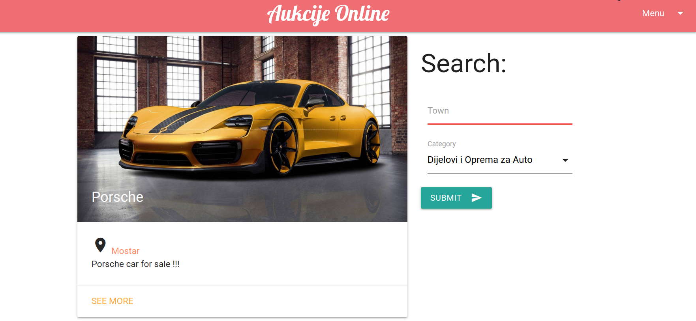
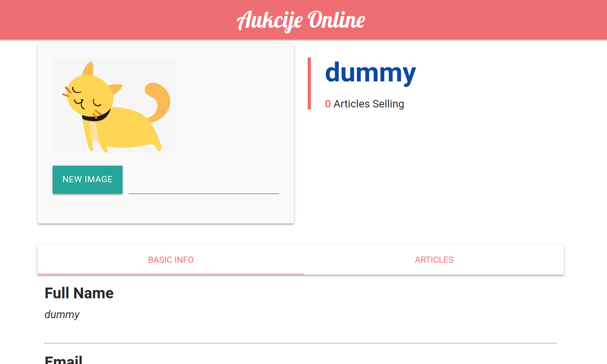
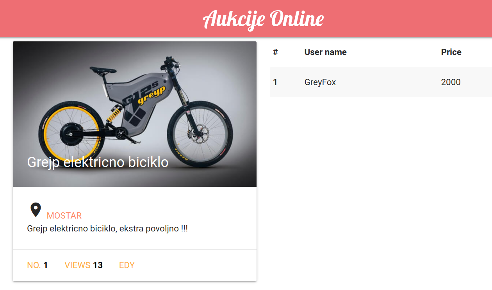

# Aukcije-online

**Aukcije-online** is real time bidding system written in Flask. On backend side, it uses *Flask-SocketIO* for real time changes in bid values. On frontend side, it uses *MaterializeCSS* to display everything in Material design.

Features:
- `Flask-WTF` for form creation and validation
- `Flask-SQLAlchemy` for database access
- `Flask-Admin` for easy control panel over actions on platform
- `Flask-SocketIO` for real time update of values
- `TinyPNG` for compression of profile and article images
- Registration with **reCaptcha** to protect from spam and abuse
- Hashing passwords with **PBKDF2**  to reduce vulnerabilities to brute force attacks

## Preview

Check at [http://aukcije-online.herokuapp.com](http://aukcije-online.herokuapp.com). It should load in few seconds if dyno is down.

You can use username `dummy` and password `dummy123` to look around and explore(*create an article, update profile and bid on articles*)

Landing page:

Profile page:

Article page:

## Install and run locally

1. Go to desired location where you want to place project and clone using `git clone https://github.com/dinko-pehar/flask-realtime-auction.git && cd flask-realtime-auction`
2. Create virtual environment 
3. With virtual env activated, install dependencies using pip as `pip install -r requirements.txt`
4. (*OPTIONAL*) Export `RECAPTCHA_PUBLIC_KEY` and `RECAPTCHA_PRIVATE_KEY` to use *reCaptcha* on registration form. You can generate keys at https://www.google.com/recaptcha/intro/v3.html
5. With `flask run`, you will run and expose application on port *5000*

---

Alternative to above is to build and run application inside Docker container as:

1. `docker build -t aukcije:latest .`
2. `docker run --rm -ti p 5000:5000 aukcije`

## Contributing and using
Pull requests are welcome. Fork, rewrite or use this application any way you want.

## License
[MIT](https://choosealicense.com/licenses/mit/)
